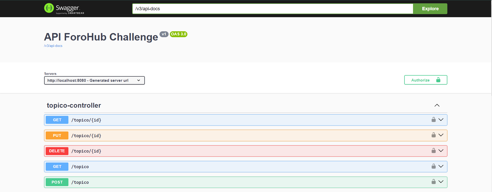
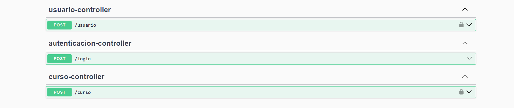
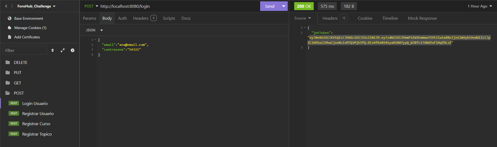
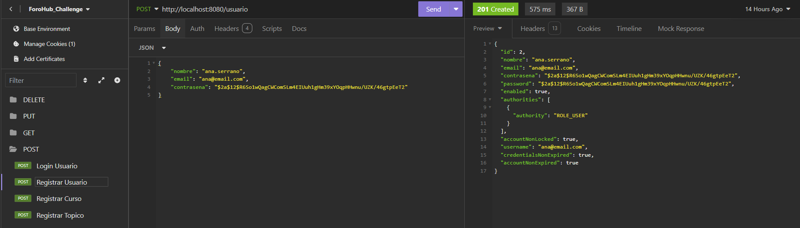
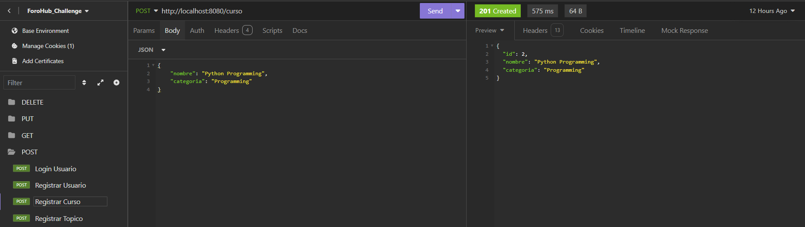
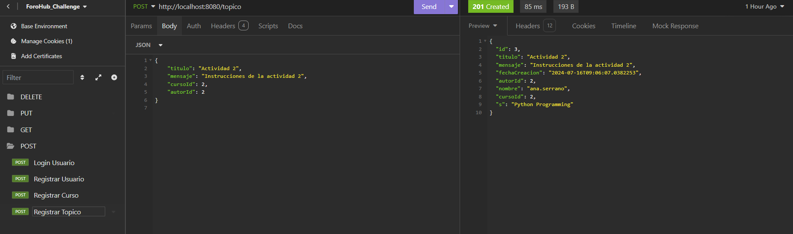
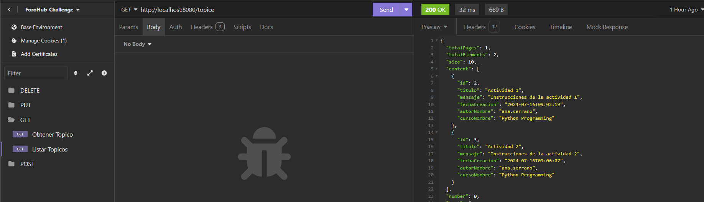
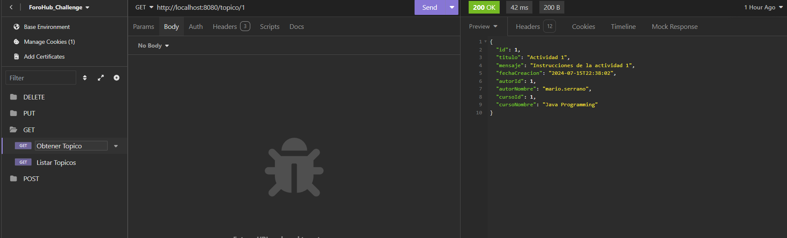
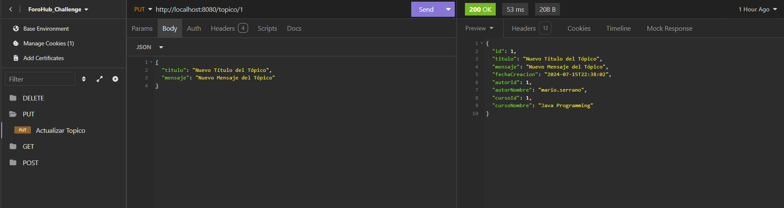
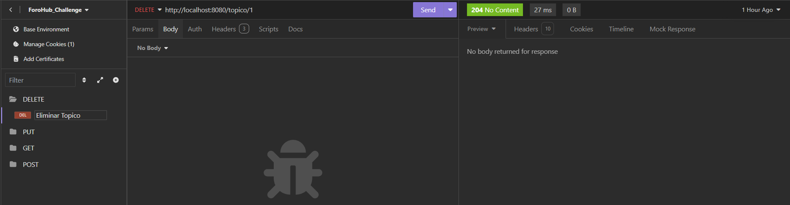

Aquí está tu README mejorado con formato:

---

# API para Foro Hub Challenge

Este proyecto es una API REST desarrollada utilizando Spring Boot, diseñada para el Foro Hub Challenge. Proporciona endpoints para gestionar usuarios, publicaciones y comentarios.

---

## Requisitos

- Java 17 o superior
- Maven 3.x
- MySQL 8.x (u otra base de datos compatible)

---

## Configuración

### 1. Clonar el Repositorio

Clona este repositorio a tu máquina local usando Git:

```bash
git clone https://github.com/Mario0SGz/ForoHub-Challenge.git
```

### 2. Configurar la Base de Datos

Crea una base de datos MySQL local llamada `foro_hub`.

Ajusta las configuraciones de conexión en `application.properties`:

```properties
spring.datasource.url=jdbc:mysql://localhost:3306/foro_hub
spring.datasource.username=tu_usuario
spring.datasource.password=tu_contraseña
```

### Compilar y Ejecutar

Para compilar y ejecutar la aplicación, usa Maven desde la línea de comandos:

```bash
mvn spring-boot:run
```

La API estará disponible en [http://localhost:8080](http://localhost:8080).

---

## Documentación API (Swagger)

Accede a la documentación interactiva de la API utilizando Swagger UI:

```bash
http://localhost:8080/swagger-ui/index.html
```

Aquí podrás explorar los endpoints disponibles, sus parámetros y respuestas esperadas.

---

## Tecnologías Utilizadas

- Spring Boot 3.3.1
- Spring Data JPA
- Spring Security
- Swagger/OpenAPI
- Flyway para migraciones de base de datos
- Lombok para reducir código boilerplate
- MySQL Connector/J

---
## Capturas de Pantalla

### Swagger UI



### Insomnia Collection

#### POST - Ejemplos de Creación


Descripción: Captura de pantalla mostrando la configuración de una solicitud POST para el login en la API.


Descripción: Ejemplo de datos enviados en una solicitud POST para crear un usuario en la API.


Descripción: Ejemplo de datos enviados en una solicitud POST para crear un curso en la API.


Descripción: Ejemplo de datos enviados en una solicitud POST para crear un tópico en la API.

#### GET - Ejemplos de Consulta


Descripción: Captura de pantalla mostrando la lista de tópicos en la API.


Descripción: Ejemplo de respuesta exitosa de la API después de realizar una solicitud GET para obtener un tópico por ID.

#### PUT - Ejemplos de Actualización


Descripción: Captura de pantalla mostrando la configuración de una solicitud PUT para actualizar información de un tópico en la API.

#### DELETE - Ejemplo de Eliminación


Descripción: Captura de pantalla mostrando la configuración de una solicitud DELETE para eliminar un tópico en la API.


---
## Contribuciones

Las contribuciones son bienvenidas. Si encuentras algún problema o tienes una mejora, por favor crea un issue o envía un pull request.
